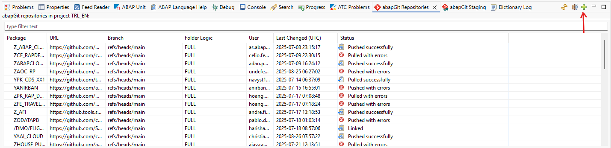
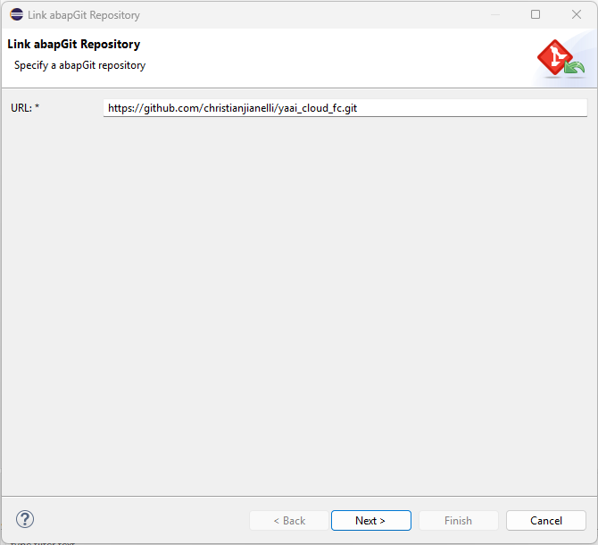
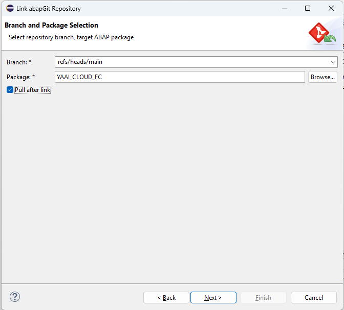
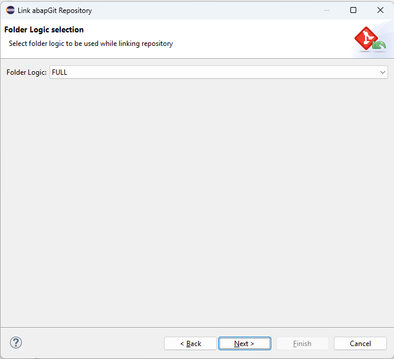
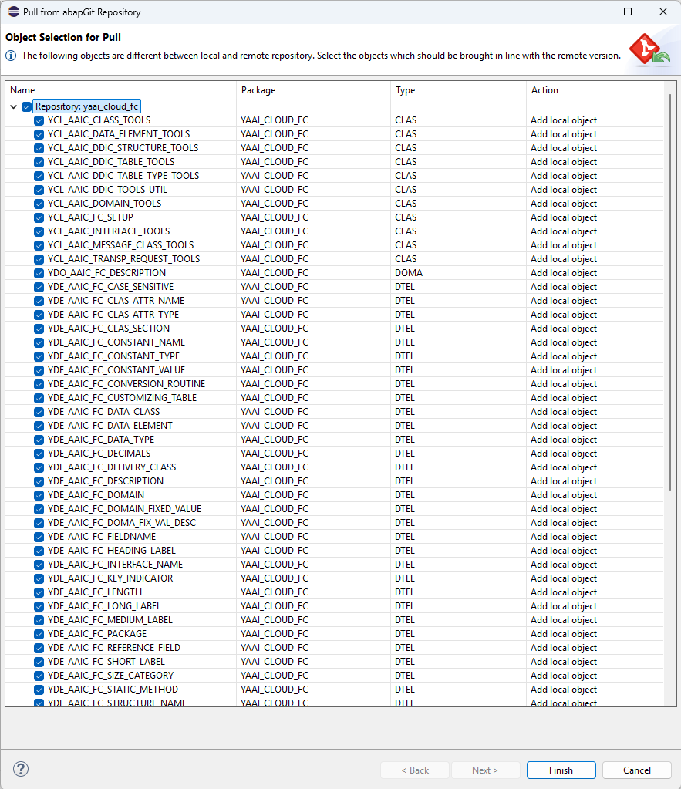
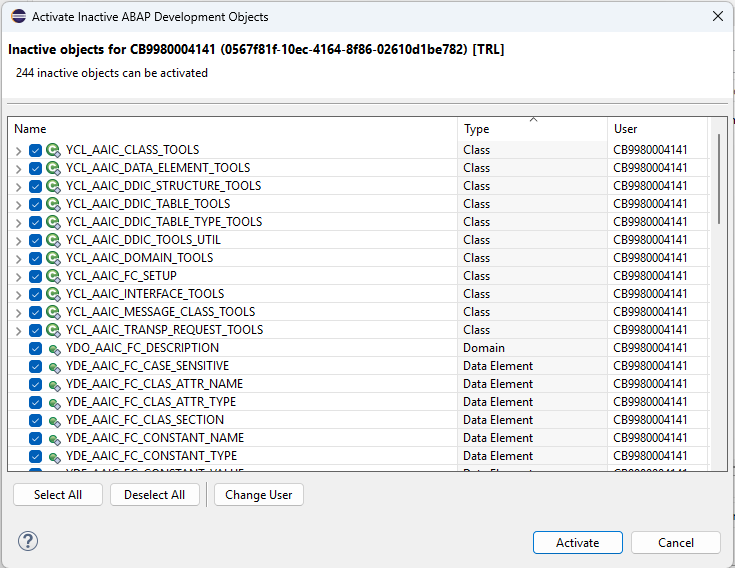

# yaai_cloud_fc
yaai_cloud_fc - ABAP AI tools Cloud - Function Calling Library

## Purpose

This library provides tools designed to be used by AI agents created with [ABAP AI tools Cloud](https://github.com/christianjianelli/yaai_cloud).

ABAP developers use ABAP AI tools Cloud to create custom AI agents. These agents can be granted access to the tools in this library, allowing them to perform actions and manage ABAP objects in the cloud system.

## Tool Overview

The tools are organized by ABAP object type. Each tool exposes operations that agents can invoke to perform ABAP development tasks in the cloud system.

### Tool Categories

- **ABAP Class Tools**: Create and manage ABAP classes.
- **ABAP Interface Tools**: Create and manage ABAP interfaces.
- **DDIC Domain Tools**: Create, update, delete, read, and search domains.
- **DDIC Data Element Tools**: Create, update, delete, read, search, and translate.
- **DDIC Structure Tools**: Create, update, delete, read, and search structures.
- **DDIC Table Tools**: Create, update, delete, read, and search tables.
- **DDIC Table Type Tools**: Create, update, delete, read, and search table types.
- **Message Class Tools**: Create, update, delete, read, and translate.

## Installation
You can install the Function Calling Library into your ABAP Cloud system using abapGit. The BTP ABAP environment comes with a preinstalled official SAP distribution of abapGit.

**Steps:**
1. Create a package named `YAAI_CLOUD_FC`;

2. Open the abapGit Repositories view and click the button with the plus sign (Link new abapGit Repository...):

   

3. Enter the URL `https://github.com/christianjianelli/yaai_cloud_fc.git`:

   

4. Specify the package:

   

5. Click the **Next** button:

   

6. Select all object and click the **Finish** button:

   

7. Activate the imported objects as needed.

   

You have now successfully installed the `ABAP AI tools Cloud Function Calling Library`.

**Optional Step:**

The `ABAP AI tools Cloud Function Calling Library` includes the setup class `ycl_aaic_fc_setup`.  Executing this class via F9 will add all tools to the `ABAP AI tools Cloud`.

## Documentation

The `docs/` folder contains markdown documents created to instruct AI agents on how to use the tools and to provide them with an overview of the tools.

See the `docs/` folder for an overview of the tools:
- [abap-class-tools.md](docs/abap-class-tools.md)
- [abap-interface-tools.md](docs/abap-interface-tools.md)
- [ddic-domain-tools.md](docs/ddic-domain-tools.md)
- [ddic-data-element-tools.md](docs/ddic-data-element-tools.md)
- [ddic-structure-tools.md](docs/ddic-structure-tools.md)
- [ddic-table-tools.md](docs/ddic-table-tools.md)
- [ddic-table-type-tools.md](docs/ddic-table-type-tools.md)
- [abap-message-class-tools.md](docs/abap-message-class-tools.md)

## Source Code

ABAP source code for each tool is located in the `src/` folder.

---
For further instructions and agent integration examples, refer to the documentation files in `docs/`.
